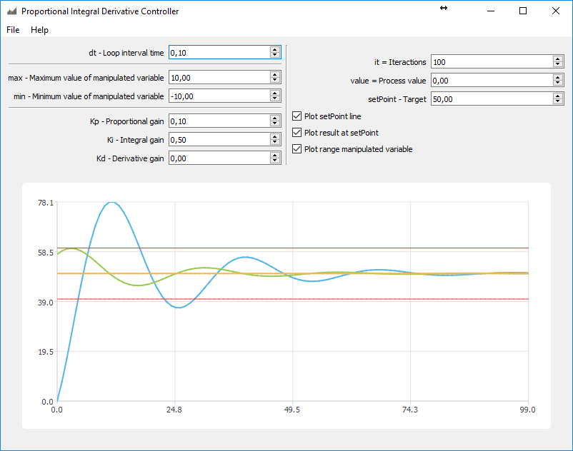

# PID Controller - Proportional Integral Derivative Controller
Build with Qt, see http://qt.io

A proportional–integral–derivative controller (PID controller or three term controller) is a control loop feedback mechanism widely used in industrial control systems and a variety of other applications requiring continuously modulated control. A PID controller continuously calculates an error value e(t) as the difference between a desired setpoint (SP) and a measured process variable (PV) and applies a correction based on proportional, integral, and derivative terms (denoted P, I, and D respectively) which give the controller its name.

In practical terms it automatically applies accurate and responsive correction to a control function. An everyday example is the cruise control on a road vehicle; where external influences such as gradients would cause speed changes, and the driver has the ability to alter the desired set speed. The PID algorithm restores the actual speed to the desired speed in the optimum way, without delay or overshoot, by controlling the power output of the vehicle's engine.

The first theoretical analysis and practical application was in the field of automatic steering systems for ships, developed from the early 1920s onwards. It was then used for automatic process control in manufacturing industry, where it was widely implemented in pneumatic, and then electronic, controllers. Today there is universal use of the PID concept in applications requiring accurate and optimised automatic control.

About this see:
https://en.wikipedia.org/wiki/PID_controller

# About
Copyright (C)2004-2018 - SimCORE - www.simcore.com.br 
Author: João Pagotto 
Contact: contato@simcore.com.br 

GNU Lesser General Public License Usage 
Alternatively, this file may be used under the terms of the GNU Lesser General Public License version 3 as published by the Free Software
Foundation and appearing in the file LICENSE.LGPL3 included in the packaging of this file. Please review the following information to
ensure the GNU Lesser General Public License version 3 requirements will be met: https://www.gnu.org/licenses/lgpl-3.0.html.

GNU General Public License Usage 
Alternatively, this file may be used under the terms of the GNU General Public License version 2.0 or (at your option) the GNU General
Public license version 3. The licenses are as published by the Free Software Foundation and appearing in the file LICENSE.GPL2 and
LICENSE.GPL3 included in the packaging of this file. Please review the following information to ensure the GNU General Public License
requirements will be met: https://www.gnu.org/licenses/gpl-2.0.html and https://www.gnu.org/licenses/gpl-3.0.html.
